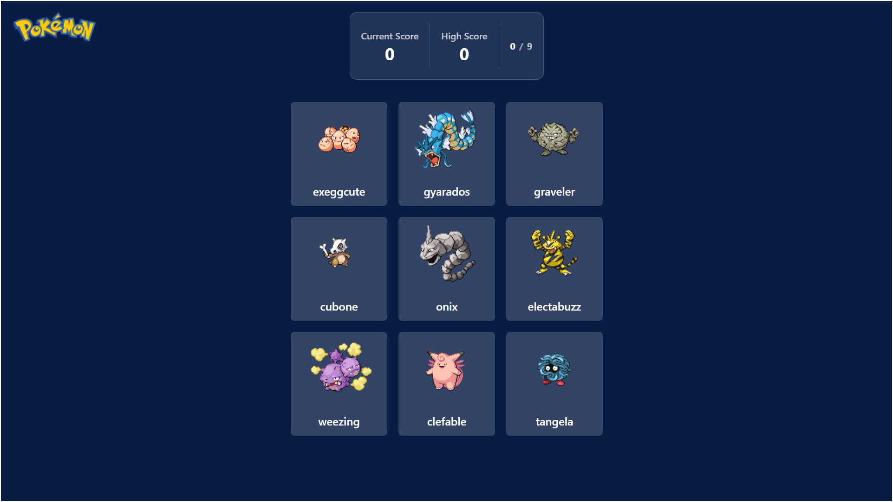

# PokémonMemory
A memory card game featuring Pokémon characters, built with React.js and Tailwind CSS.

🔗 **Live Preview**: [Launch App](https://pokememory-sepia.vercel.app/)

## Screenshot


## Installation
> **Note:** The app is also playable live at the link above.

1. **Clone the repository**  
   ```bash
   git clone https://github.com/rycatt/pokememory.git
   ```

2. **Navigate to the project folder**
   ```bash
   cd pokememory
   ```

3. **Install dependencies**
   ```bash
   npm install
   ```

4. **Start the development server**
   ```bash
   npm start
   ```


## Built With
- 
- 
- 


## Author
Created by **[@rycatt](https://github.com/rycatt)**  
Built with guidance from The Odin Project 
